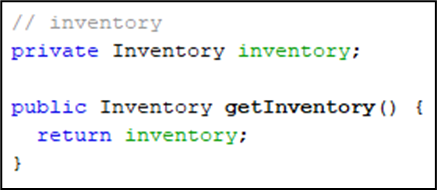

# 2D-Sandbox-Game
 
## Define the Problem and Proposed Solution
I love playing with AI and that made me want to have a versatile and resourceful playground.
To achieve that, I needed a game engine with full access to everything in the game.
Therefore, I made a 2D sandbox game engine from scratch with Java.

I could've used an existing libraries or game engines like Unity, Unreal, Godot, etc.
However, I did not - hoping to get more in-depth insight into game development.

## Design

(-------- data structure image -----------)

Above is the data structure image. I utilized OOP techniques as much as possible 
for better organization.  

